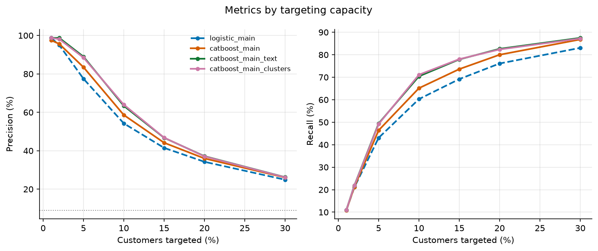

The task is to identify customers with elevated risk of leaving during the next six months and translate that risk into a practical prioritization of limited advisor capacity.

### Main findings

  * **The 10% highest-risk customers contain 71.1% of all churners.** Of the customers selected, **64.0% subsequently churn** — about **7.1x** the rate of random selection.
  * **Inquiry text raises average precision from 0.684 to 0.742.** TF-IDF and embedding-derived topics perform similarly, so what customers write about carries information beyond how often they make contact.
  * **The strongest signals are falling digital engagement, recent contact, and inquiries about mortgage rates and account-closure fees.**

### Motivation and modelling choices

I understand the business problem is to identify customers who can be prioritized for retention because they are at elevated risk of leaving, while recognizing that advisor capacity is limited. Therefore, I do not view the task as simply classifying customers into “churn” or “no churn”. Instead I treat the problem primarily as a **ranking problem**, using predicted churn probabilities to order customers by risk. The main evaluation metrics I use are **Precision@k** and **Recall@k**.

I use **logistic regression** as an interpretable baseline and **CatBoost** as the main predictive model.  CatBoost can capture nonlinear relationships and interactions in mixed numerical and categorical data without requiring extensive preprocessing.

### Analysis and feature engineering

Data-quality work was a substantial part of the effort:

  * **Duplicates.** 400 `kunde_id` appear twice; kept the higher advisor-call count.
  * **Inconsistent categories.** Seven spellings of `har_kundeprogram`; counties, mixed case.
  * **Implausible values.** Six ages of 121–141 set to missing; six negative deposits clipped.
  * **Leakage.** Cancellation fees, product counts and a relative's future churn are excluded.
  * **Seasonality.** Activity compared with the same quarter a year earlier, not last month.

### Relations

Customers connected through partner or co-borrower relationships show correlated churn descriptively. Household pairs churn together in **1.30%** of pairs against **0.81%** expected under independence — a **1.6x** joint lift. Due to a small fraction of related customers churning, I consider relationships an interesting analytical finding, but have not modeled it for prediction.

### Customer inquiries and text

I tried two versions of text analysis: TF-IDF and embedding-based. I embed individual inquiries using **Qwen3-Embedding-0.6B** and cluster the embeddings into semantic themes. A locally served language model assigns short, human-readable names to representative messages from each cluster. The labels are used for interpretation only and do not affect the clustering. The themes include mortgage-rate comparisons, account-closure fees, digital banking problems and refinancing. Compared to TF-IDF, the embedding-topic approach provides an additional interpretability benefit because the text can be summarized into business-readable themes.

### Evaluation and business recommendation

{width=72%}

At 5% reach-out, 88.5% of those contacted would have churned, capturing 49.2% of all churners. At 10%, precision falls to 64.0% while recall rises to 71.1%.

The model does not decide who to contact; it returns a ranked list. How far down that list to go is an economic choice — advisor capacity against the value of a retained customer.
Additionally, a customer's inquiry themes provide context on what they were struggling with and can help an advisor choose a relevant conversation -- for example repricing, fee review or technical support. The engagement features add the same kind of context, flagging customers whose card and login activity has dropped below their own norm.

I would therefore use the model as a **prioritization tool in a controlled retention pilot**: with advisors working the ranked list against a randomly held-back control group.

### Production and lifecycle

I would build the solution around **Snowflake as the governed analytical data layer**, with dbt used to create timestamped, tested feature tables. Training and scheduled batch scoring could run as a versioned Python workload on AWS, with predictions written back to Snowflake and made available to the bank's advisor or CRM workflow.

I would monitor data quality (missingness, schema, freshness), drift (feature and topic distributions, predicted risk) and performance (Precision@k, Recall@k, calibration) once outcomes arrive.

I would not retrain simply because a fixed amount of time has passed. Retraining should be triggered by sufficient new labelled data, deteriorating performance, meaningful data drift or material changes in products/customer behaviour.

### Privacy and ethics

The model uses sensitive banking behaviour, free text and relationship data, so I would apply strict purpose limitation, data minimization and access controls, confirm permitted use with privacy/compliance, avoid exposing one customer's information to another, and keep the score as decision support rather than an automatic basis for adverse treatment.

### What I would do with two additional weeks

I would explore whether relationships add any meaningful predictive value, test the robustness and stability of the current results more thoroughly, and refine the evaluation of where the model becomes economically useful for retention outreach.

### Use of AI tools

I used Claude Code as a development and review aid, with prompts such as *"Profile the four files: write a script to generate histograms for the numeric features, a line plot for the activity, value counts with churn rate for the categorical ones."*
